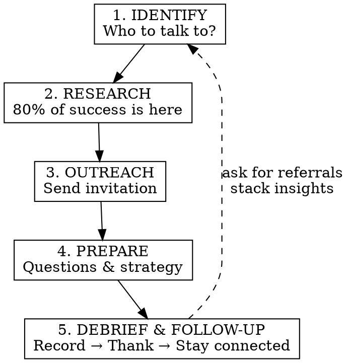

# Coffee Chat Networking

## Overview

大学生 Coffee Chat 全流程攻略。一场成功的 Coffee Chat，**80% 的功夫在见面之前**。你的每一次打扰，都是在消耗对方的时间成本——通过充分的前期调研，展现尊重和诚意，成功率才会大大增加。

## When to Use

- Planning to reach out to someone for a coffee chat or informational interview
- Need to write a cold outreach message (LinkedIn, email, WeChat)
- Preparing for or following up after a career fair / networking event
- Preparing questions before a scheduled coffee chat
- Want to debrief and follow up after a conversation
- Building a networking tracker to manage contacts

## Workflow



## Core Mindset

Before diving into tactics, internalize these principles:

- **Be GENUINELY interested** in the other person — not performatively, genuinely
- **Be enthusiastic** — it's contagious; everyone wants to connect with someone who is excited, eager, and passionate
- **Proactively add value** — don't just take; think about what YOU can offer (resources, introductions, platform, feedback)
- **Warm intros > cold outreach** — there's already trust built in; think expansively about who can introduce you (friends, professors, career services, club advisors)
- **Stack insights** — bring nuggets from one conversation into the next; eventually all insights can be used in interviews too

## Phase Details

### 1. IDENTIFY — Find the Right People

**Ask the user:**
- Target person type? (学长学姐 / 老师教授 / hiring manager / 行业前辈 / 职场人士)
- Any warm connections (alumni, mutual contacts)?
- Specific goal (explore direction, learn about role, seek mentorship, job seeking)?
- Any upcoming career fairs or networking events?

**Output:** A prioritized list of people to reach out to, with reasoning.

**Prioritize hiring managers / decision-makers.** They make final decisions. If you know which companies you're targeting, research who from those teams will be at the event.

**Strategy by source:**
| Source | Approach | Priority |
|--------|----------|----------|
| Warm intro (mutual connection) | Ask for introduction — highest success rate | Highest |
| Career fair / event contact | Reference the specific conversation you had | High |
| 学长学姐 | Lead with shared school/major, casual tone | High |
| 老师教授 | Formal but warm; professors often refer students to contacts | High |
| LinkedIn (2nd degree) | Mention mutual connection | Medium |
| Alumni network | Lead with shared school | Medium |
| Cold (no connection) | Lead with genuine interest in their specific work | Lower |

**Think expansively for warm intros:** friends, previous colleagues, professors, career services, club connections. Professors have referred students to their professional contacts more often than you'd think.

### 2. RESEARCH — 80% of Success is Here

**This is the most critical phase.** Don't skip it. Asking questions easily Googled is a fatal mistake that wastes their time and kills your credibility.

**Research checklist by target type:**

#### For 学长学姐:
- Check their 朋友圈 / 小红书 (if you have access) for recent updates
- Ask mutual friends about their recent big events or projects
- Know their current company/role, career transitions
- Find shared interests, hobbies, or experiences

#### For 老师教授:
- Go to the **school/department official website** — read their full profile
- Education background (院校、学历)
- Research direction & recent publications
- Career path & industry experience
- Awards or notable projects

#### For 职场人士 / Hiring Managers:
- LinkedIn profile deep-dive: career path, transitions, posts, articles
- What specifically they're in charge of at the company
- Company recent news (funding, product launches, awards)
- Shared backgrounds (school, hometown, interests)
- Think about **specific questions** you'd have for them based on their background

#### 行业 & 业务调研 (适用于所有类型)
不只了解"这个人"，还要了解"他做的事"。这样聊天时能问出有深度的问题，也让对方觉得你是认真的。

- **行业基本面** — 这个行业是怎么赚钱的？主要的商业模式是什么？产业链上下游有哪些关键角色？
- **行业近期新闻** — Google / 微信搜一搜 / 36氪 / 行业垂直媒体，找近 1-3 个月的重大事件（政策变化、并购、融资、技术突破）
- **公司在行业中的位置** — 竞争对手是谁？公司的核心优势和差异化在哪？面临什么挑战？
- **对方部门/职能的业务逻辑** — 他的团队在公司里承担什么角色？日常产出是什么？KPI 怎么衡量？
- **行业热门话题** — 当前行业里大家在讨论什么？（例如 AI 对行业的影响、监管变化、市场趋势）

**为什么重要：** 你不需要成为行业专家，但了解基本业务逻辑后，你的提问会从"你们公司是做什么的"升级为"我注意到你们公司最近在 X 方向发力，这对你的团队意味着什么"——质量完全不同。

**Show you've done your research:** compliment specific projects/writings, bring up relatable areas or similarities in past experiences.

**Output:** A research brief saved to `~/Desktop/Claude/coffee-chat/`.

### 3. OUTREACH — Craft the Message

**Principles:**
- **Short** (under 100 words for LinkedIn, under 150 for email)
- **Specific** — mention WHY them, not generic flattery
- **Low ask** — "15-20 minutes" not "pick your brain"
- **No attachments** on first cold message (attach resume only AFTER establishing connection)
- **AVOID bringing up requests before you've at least connected** on LinkedIn
- **Proactively add value** where possible

**Three effective hooks for opening:**
1. **主动提及对方的优势** — show you've done research, acknowledge their specific strengths
2. **主动提及双方的交集** — shared school, mutual friends, common interests
3. **对双方都了解的第三方内容发表观点** — comment on something both of you follow

**Ways to proactively add value in your message:**
- "I saw your podcast and have a few suggestions on content that could drive more engagement with the uni audience"
- "I'm part of Club X and could provide a platform (via our social media) to advertise your next workshop"
- "Coffee on me — thank you in advance for your time!"

Even if they won't let you pay as a student, the gesture shows you're trying to give, not just take.

**Templates (adapt, never copy-paste):**

#### LinkedIn Connection Request (300 char limit)
```
Hi [Name], I came across [specific article/video] and really enjoyed your perspectives, especially [insight that resonates with you]. I'm currently [student @ school] keen on building a career in [role/company]; would love to connect!
```

#### Post-Event Outreach (the 5% advantage)
Less than 5% of students follow up after career fairs for 1-on-1 coffee chats. This is where you truly stand out.

```
Subject: Great meeting you at [Event Name]!

Hi [Name]!

We met yesterday during [Event]. Really appreciate your time, and our energising conversation. Especially fascinated by [specific thing from your convo — e.g., "your transition from Medicine to Tech — a path less taken, but a strong balance of your desire to help patients and scale impact globally!"]

I know you must be super busy, especially with [something you researched — e.g., "the upcoming product launch at Company X"]. If you might have 15-20min, I'd love to chat more about [specific role/topic], and whether it might be a mutual fit.

Specifically, I'm very keen to understand [2-3 specific questions relevant to THEIR work, not generic].

Coffee on me if you have time to meet in person, otherwise a call works too. If you could provide 2-3 time slots, I'm happy to adapt to one of them. Thank you so much in advance!

Best,
[Your Name]
```

**Anatomy of a great post-event outreach:**
| Element | Purpose |
|---------|---------|
| Specific reminder of YOUR conversation | Proves you paid attention |
| High EQ / empathy move | Acknowledge they're busy, appreciate their time |
| Specific ask relevant to THEIR role | Shows research, not generic interest |
| Offer flexibility on format | Coffee / call / in-person — lower the barrier |

#### Email Outreach (cold)
```
Subject: [School] student interested in [their field/company]

Hi [Name],

My name is [Your Name], a [year] [major] student at [school]. I found your profile through [source] and was impressed by [specific detail about their career/work].

I'm exploring careers in [field] and would love to hear about your experience at [company], especially [specific topic]. Would you have 15-20 minutes for a virtual coffee chat in the coming weeks?

I'm happy to work around your schedule. Thank you for considering!

Best,
[Your Name]
```

#### WeChat (for 学长学姐, more casual)
```
[Name]学长/学姐你好！我是[school][major][year]的[Your Name]，通过[source]了解到你。看到你在[specific thing]的经历觉得特别厉害，想请教一些关于[topic]的问题，不知道方不方便抽15-20分钟聊聊？非常感谢！
```

#### Follow-up if No Response (wait 5-7 business days)
```
Hi [Name], I wanted to follow up on my previous message. I understand you're busy — if now isn't a good time, I'd be happy to connect whenever works best for you. Thanks again!
```

**Output:** Ready-to-send message saved to `~/Desktop/Claude/coffee-chat/`.

### 4. PREPARE — Questions & Strategy

**Ask the user:**
- What do you most want to learn?
- Any specific concerns or decisions you're facing?
- How much time do you have (15 min vs 30 min)?

**Core principle: 把话头抛给对方。** Choose topics they're good at and interested in — that's where the real conversation happens. Everyone loves talking about themselves.

**Be prepared to concisely answer common questions about yourself** (aka "soft" interview prep):
- What are you studying and why?
- What are you looking to do after graduation?
- Why are you interested in this field/company?

**For 老师教授:**

| Phase | Content |
|-------|---------|
| Opening (2 min) | Brief self-intro, then ask about their background |
| Their Story (8-10 min) | 读博经历、科研经历、工作经历、学校近年变化 |
| Deep Dive (5-8 min) | Pick up on interesting details, dig deeper |
| Your Questions (3-5 min) | Specific questions about your direction |
| Closing (2 min) | Thank sincerely, ask how to stay in touch |

**Tip:** 初次线下见面，可以准备小礼物——文创产品或有价值的书（选书也要投其所好）。

**For 学长学姐:**

| Phase | Content |
|-------|---------|
| Warm-up (3-5 min) | 从学校八卦或校园大事开始，轻松破冰 |
| Their Experience (8-10 min) | Career path, transitions, lessons learned |
| Deeper Topics (5-8 min) | 规划、行业观察、更深层的问题 |
| Closing (2 min) | Ask for introductions, stay in touch |

**For 职场人士 / Hiring Managers:**

| Phase | Content |
|-------|---------|
| Opening (2 min) | Thank them, brief self-intro (30 sec max) |
| Their Story (5-8 min) | "What drew you to [field]?" / Career path |
| Role & Insights (5-8 min) | Day-to-day, surprising skills, challenges |
| Industry (5 min) | Trends, advice for newcomers |
| Closing (2 min) | "Who else should I speak to?", best way to stay in touch |

**Always end by asking: "Who else should I speak to?"** This creates a chain of warm intros and lets you stack insights across conversations.

**Output:** Customized question list + conversation flow saved to `~/Desktop/Claude/coffee-chat/`.

### 5. DEBRIEF & FOLLOW-UP — 复盘 → 感谢 → 保持联系

聊完之后的流程：**先复盘整理，再基于复盘内容写 follow-up**。

#### Step 1: 复盘 (聊完当天)

**支持录音/文字稿输入：** 用户可以上传对话录音转写稿，Claude 会自动提取关键信息并生成结构化复盘。

**Ask the user:**
- 有没有录音或文字稿可以上传？（如有，自动提取以下信息）
- What were the key takeaways?
- Any names/contacts they mentioned? (for referral chain)
- Action items (things to look into, people to contact)?
- What went well? What would you do differently?
- How would you rate the connection (strong / moderate / light)?

**记录要点：**
- 口味爱好、性格特征
- Topics that lit them up (useful for future conversations)
- Things to avoid (雷点)
- Resources or books they recommended
- Specific insights you can "stack" into future conversations or interviews
- Their preferred communication style and channel

**Stacking insights:** Take specific insights from this conversation and note which ones can be brought into your next networking conversation or interview. This compounds over time.

#### Step 2: Thank You (within 24 hours)

基于复盘内容，生成个性化的感谢消息——不是套模板，而是引用聊天中的具体内容。

```
Subject: Thank you for your time, [Name]!

Hi [Name],

Thank you so much for taking the time to chat with me today. I really appreciated hearing about [specific topic discussed].

Your insight about [specific advice] was especially helpful — I'm planning to [concrete action you'll take based on their advice].

[If they mentioned a resource/contact]: I'll definitely check out [resource] / reach out to [person] as you suggested.

I'd love to stay in touch. Wishing you all the best with [something they mentioned].

Best,
[Your Name]
```

#### Step 3: Reflection & Feedback (within 1 week)

在一周内整理复盘，向对方反馈你的行动和思考——双方可能碰撞出更多精彩想法。

```
Hi [Name],

Following up on our chat last [day] — I've been thinking about what you said regarding [topic] and wanted to share some thoughts:

[Your reflection / action taken / question that came up]

Would love to hear your perspective if you have a moment. Thank you again!

Best,
[Your Name]
```

#### Step 4: 长期维护

| Timeframe | Action |
|-----------|--------|
| 24 hours | Thank-you message (Step 2) |
| 1 week | Reflection + feedback (Step 3) |
| 2-4 weeks | Share relevant article or update |
| 3 months | Brief check-in or life update |
| When relevant | Share good news, congratulate their achievements |

**请保持联系——人很大程度上也讲感情。**

**Output:** Structured debrief + follow-up messages saved to `~/Desktop/Claude/coffee-chat/`.

## Career Fair → Coffee Chat Pipeline

Career fairs are not the end — they're the beginning. The real value comes from **post-event 1-on-1 follow-ups**.

**Before the event:**
- Research which hiring managers / target companies will be there
- Peruse their LinkedIn to understand their background and role
- Prepare specific questions for each person

**During the event:**
- Leave a good first impression (enthusiasm, genuine interest)
- Listen carefully, come up with intelligent follow-ups
- Collect contact info or LinkedIn connections
- Take quick notes after each conversation

**After the event (the 5% advantage):**
- Send post-event outreach within 24-48 hours (use template above)
- Ask for a 1-on-1 coffee chat — this is where real relationships form
- Less than 5% of students do this, so you automatically stand out

## Common Mistakes

| Mistake | Fix |
|---------|-----|
| 问些能在网上轻易查到的问题 | Do your homework; ask for personal insights only |
| 完全不了解对方背景 | 80% of effort goes to pre-chat research |
| Generic outreach ("I'd love to pick your brain") | Use the 3 hooks: their strengths, shared connections, shared topics |
| Talking too much about yourself | 少说话多回应，80/20 rule |
| No follow-up after the chat | Thank-you within 24 hours, reflection within 1 week |
| Treating it as a one-time transaction | 保持联系，人讲感情 |
| Asking for a job / attaching resume on first cold message | Build connection first; only attach resume after rapport is established |
| 不敢联系老师 | 肯回应你的老师也是愿意亲近和帮助学生的 |
| Not asking "who else should I speak to?" | Always ask — this creates referral chains and stacks insights |
| Only taking, never giving | Proactively add value: offer resources, platform, connections |
| Skipping career fair follow-up | Less than 5% of students follow up — be in that 5% |
| Bad first impression from carelessness | First impression is extremely hard to recover from; be sharp from day one |

## Output Format

All outputs are:
1. Displayed in the conversation for immediate use
2. Saved as `.md` files to `~/Desktop/Claude/coffee-chat/` for archiving

File naming: `{date}-{person-name}-{phase}.md` (e.g., `2026-05-22-jane-doe-outreach.md`)
